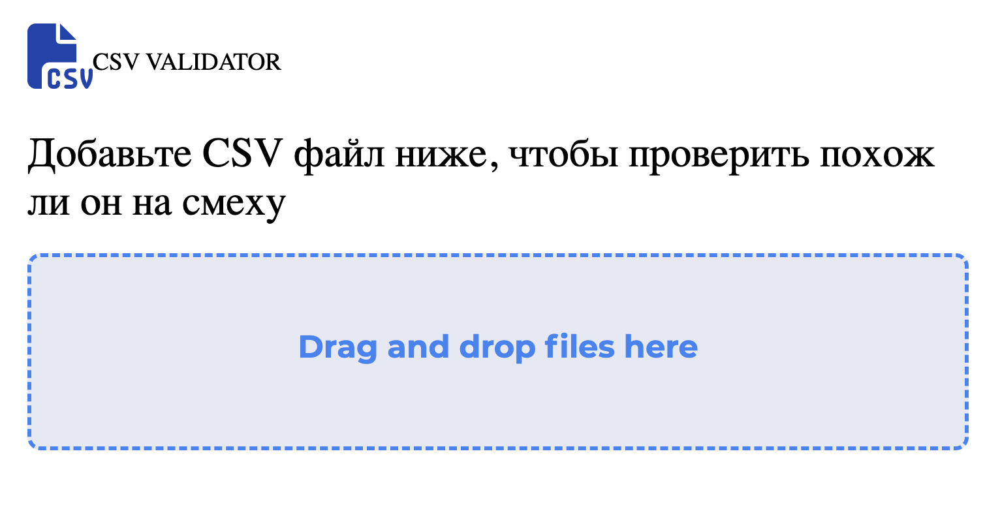
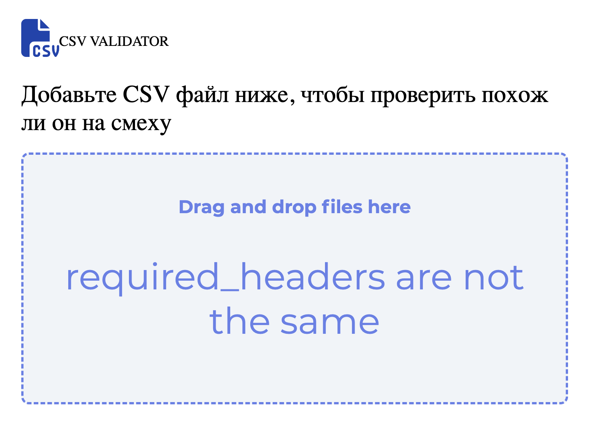
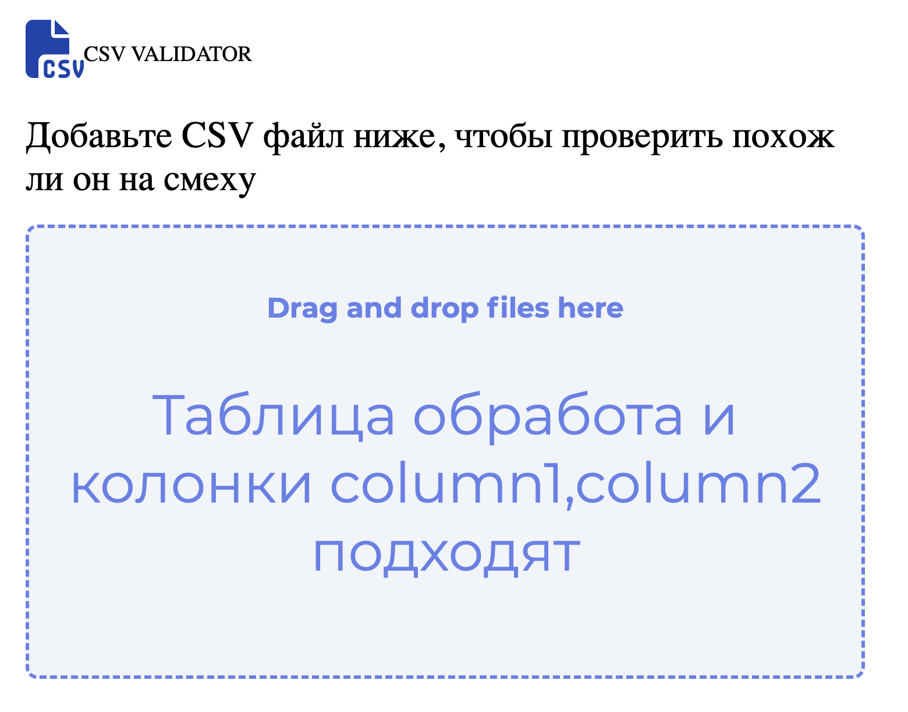

## Introduction

Данный проект представляет из себя валидатор таблиц CSV формата. Валидатор проверяет подходит ли таблица по содержанию под то, что находится в базе данных и выдает вердикт с ошибками. Проект реализован с удобной зоной Drag and Drop с использованием react

## Functionality
1. Пользователь загружает файл через Drag and Drop (также можно загружать через сервер используя fetch)
2. Данные загружаются и создается схема вида: `{col: { type: Number},
col2: {type: String}}`
3. Из базы данных загружаются все действующие на данный момент схемы
4. Текущая схема проверяется с на соответствие со схемами типа `{col: { type: Number, min: value, max: value }},
col2: {type: String, pattern: regExpression}`. Причем проверяются все численные значения на вхождение в range(min, max), а текстовые значения проверяются по регулярному выражению regExpression
5. На каждом этапе функция собирает данные об ошибках и отправляет вердикт обратно в приложение, которое выводит все ошибки на экран

## Interface

Перед загрузкой данных

Обработка одной из ошибок

Если загруженный файл содержит нужные колонки, то они выводятся вместе с вердиктом
